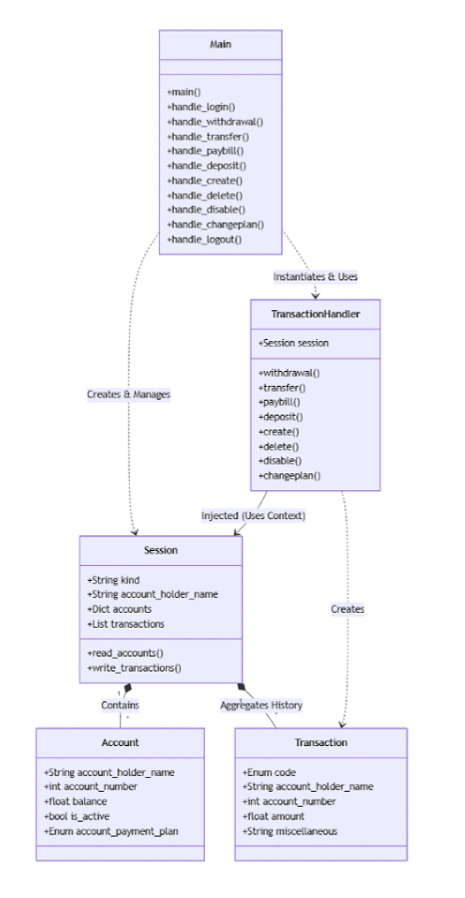

<!-- Improved compatibility of back to top link: See: https://github.com/othneildrew/Best-README-Template/pull/73 -->
<a id="readme-top"></a>
<!--
*** Thanks for checking out the Best-README-Template. If you have a suggestion
*** that would make this better, please fork the repo and create a pull request
*** or simply open an issue with the tag "enhancement".
*** Don't forget to give the project a star!
*** Thanks again! Now go create something AMAZING! :D
-->


<!-- PROJECT SHIELDS -->
<!--
*** I'm using markdown "reference style" links for readability.
*** Reference links are enclosed in brackets [ ] instead of parentheses ( ).
*** See the bottom of this document for the declaration of the reference variables
*** for contributors-url, forks-url, etc. This is an optional, concise syntax you may use.
*** https://www.markdownguide.org/basic-syntax/#reference-style-links
-->
![Contributors][contributors-shield]
![Issues][issues-shield]


<!-- PROJECT LOGO -->
<br />
<div align="center">
  <a href="">
    
  </a>
</div>

<!-- PROJECT HEADER SECTION (Links need to be added later down the line) -->

<h3 align="center">
  <a>Banking System</a>
</h3>


  <p align="center">
    System managing account balances and transactions.
    <br />
    <a href=""><strong>Explore the docs (Coming Soon)»</strong></a>
    <br />
    <br />
    <a href="">View Demo</a>
    &middot;
    <a href="">Report Bug</a>
    &middot;
    <a href="">Request Feature</a>
  </p>
</div>


<!-- TABLE OF CONTENTS -->
<details>
  <summary>Table of Contents</summary>
  <ol>
    <li>
      <a href="#about-the-project">About The Project</a>
      <ul>
        <li><a href="#built-with">Built With</a></li>
        <li><a href=#architecture>Architecture</a></li>
      </ul>
    </li>
    <li>
      <a href="#getting-started">Getting Started</a>
      <ul>
        <li><a href="#prerequisites">Prerequisites</a></li>
        <li><a href="#installation">Installation</a></li>
      </ul>
    </li>
    <li><a href="#usage">Usage</a></li>
    <li><a href="#roadmap">Roadmap</a></li>
    <li><a href="#contributing">Contributing</a></li>
    <li><a href="#license">License</a></li>
    <li><a href="#contact">Contact</a></li>
    <li><a href="#acknowledgments">Acknowledgments</a></li>
  </ol>
</details>


<!-- ABOUT THE PROJECT -->
## About The Project


The Banking System is a modular command-line application that simulates core banking operations including withdrawals, deposits, transfers, bill payments, and administrative account management.
The system enforces strict banking rules, session controls, and privilege levels while serializing transactions for backend processing.

Key Features:
* Modular architecture
* Session-based login system (Standard & Admin roles)
* Banking rule enforcement (limits, balance checks, validation)
* Admin operations (create, delete, disable, change plan)
* Transaction serialization
* Automated regression testing with shell script framework

<p align="right">(<a href="#readme-top">back to top</a>)</p>

### Built With

![Python][Python]
<p align="right">(<a href="#readme-top">back to top</a>)</p>


## Architecture



## Getting Started

To get a local copy up and running follow these steps.

### Prerequisites

* Python 3.9+

### Installation

1. Clone the repo
   ```sh
   git clone https://github.com/Aranno808/CSCI-3060-Assignment
   ```

<p align="right">(<a href="#readme-top">back to top</a>)</p>


<!-- USAGE EXAMPLES -->
## Usage

1. Start the program

2. Log in as either:
    * Standard user
    * Admin user

3. Perform supported transactions:
    * Withdraw
    * Deposit
    * Transfer
    * Pay bill
    * Create/Delete/Disable account (Admin only)

4. Logout to finalize the session


<p align="right">(<a href="#readme-top">back to top</a>)</p>

## Running Automated Tests
```sh
   chmod +x run_tests.sh
    ./run_tests.sh 
```
This will: 
- Execute all test input files
- Compare outputs against expected baselines
- Generate a test_summary.log with pass/fail results

<p align="right">(<a href="#readme-top">back to top</a>)</p>


<!-- ROADMAP -->
## Roadmap

- [X] Team Formation
- [X] Front End Requirements
- [X] Front End Rapid Prototyping
- [] Front End Requirements Testing
- [] Back End Rapid Prototyping
- [] Back End Unit Testing
- [] Integration and Delivery

See the [open issues](https://github.com/Aranno808/CSCI-3060-Assignment/issues) for a full list of proposed features (and known issues).

<p align="right">(<a href="#readme-top">back to top</a>)</p>

<!-- Shield Links -->
[Python]: https://img.shields.io/badge/Python-3776AB?style=for-the-badge&logo=python&logoColor=white
[contributors-shield]: https://img.shields.io/github/contributors/Aranno808/CSCI-3060-Assignment.svg?style=for-the-badge
[issues-shield]: https://img.shields.io/github/issues/Aranno808/CSCI-3060-Assignment.svg?style=for-the-badge
