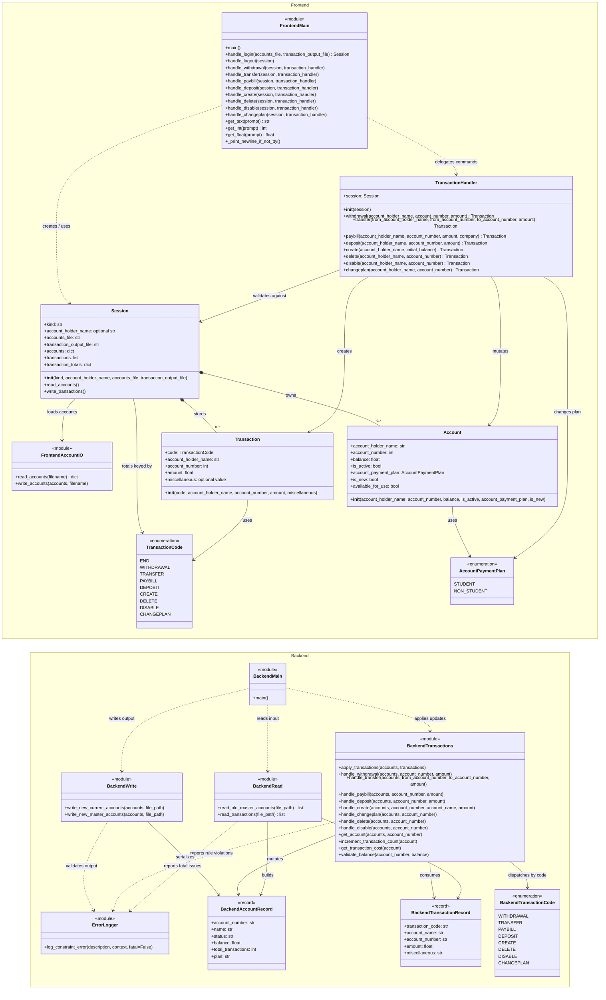

# UML Class Diagram

This diagram uses Mermaid so it can render directly on GitHub.

Conventions used here:

* `<<module>>` represents a Python module with module-level functions.
* `<<record>>` represents the dictionary-shaped backend records used in code.
* `<<enumeration>>` represents an enum.

